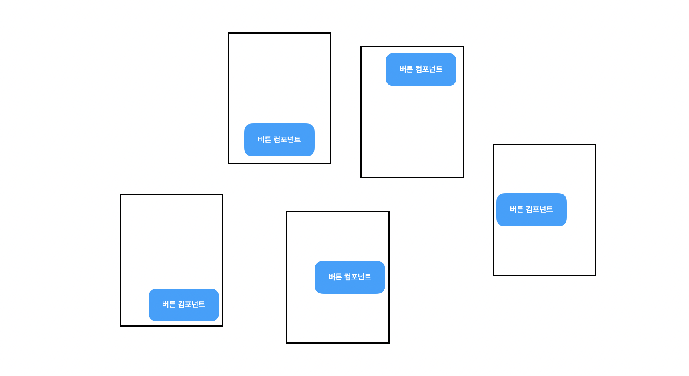
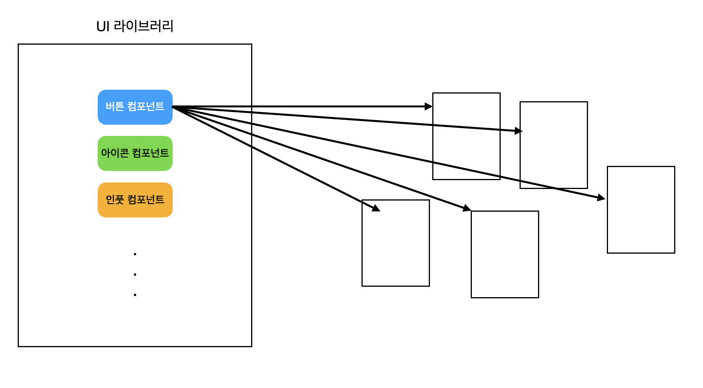
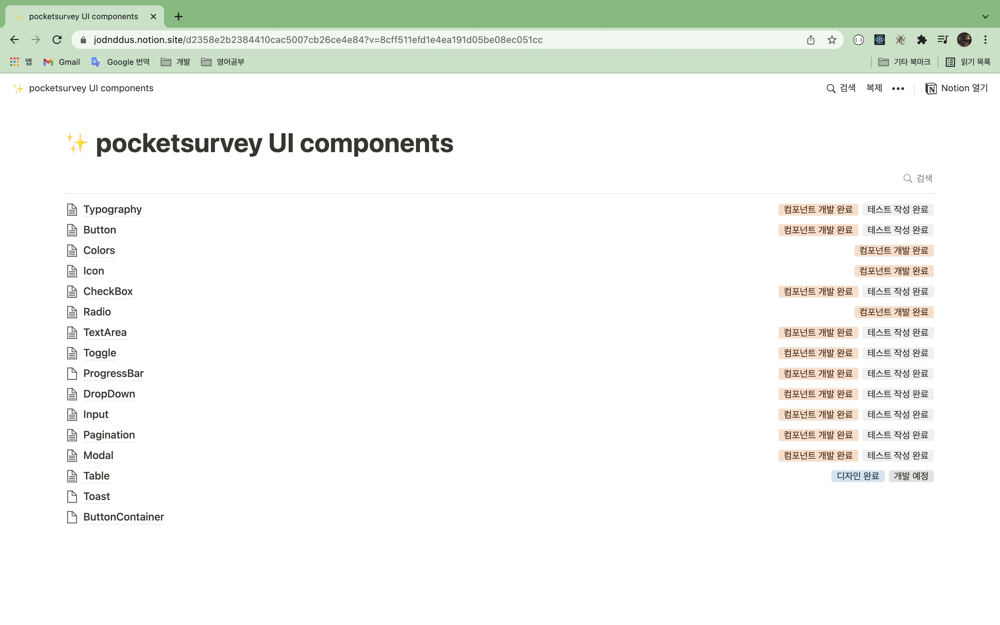
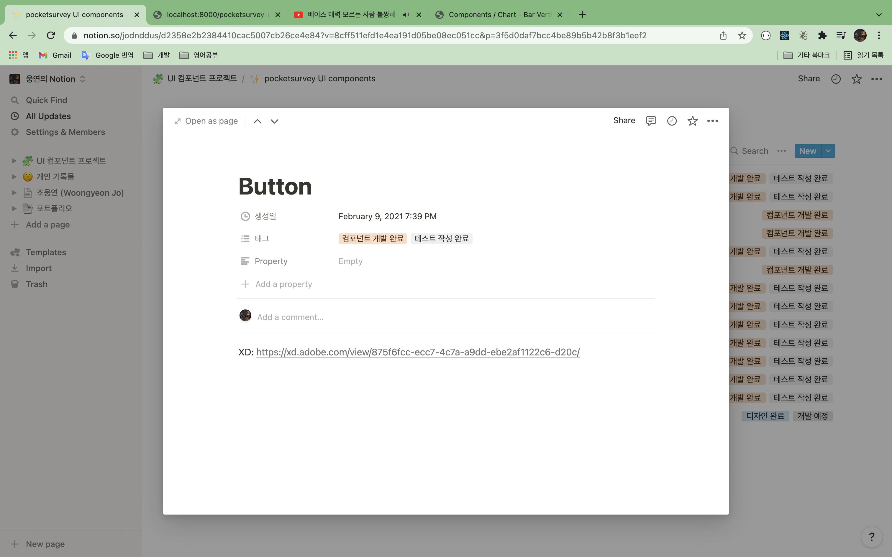

제가 얼리슬로스에 입사하고 1년 4~5개월 정도 되었을 때는 모든 개발 인력이 신규 기능 개발에 가담되어 있었습니다. 그러다보니 정말 빠른 속도로 기능이 개발되었는데요.

디자인 시스템이 없는 상태에서 개발 작업이 진행되다 보니까 공통적으로 사용되는 컴포넌트 코드가 기능별로 생기게 되었습니다.



이런 현상은 버튼 컴포넌트 뿐만 아니라 공통적으로 사용되는 다른 모든 컴포넌트에도 포함되는 현상이였습니다. 보통 UI에 관련된 컴포넌트들이 중복적으로 사용되었고, 이 중복 코드들을 해결하기 위한 솔루션을 찾다가 **UI 라이브러리, 디자인 시스템** 이라는 단어들을 알게 되었습니다.

해당 단어들을 가지고 검색을 조금 더 해본 결과, 자사 서비스를 개발하는 조직들은 거의 자사 디자인 시스템을 이용해서 UI 라이브러리를 만들어 사용한다는 것을 알게 되었습니다.



진행하던 개발 업무를 끝마치고, 저는 아래 효과들을 이끌어내기 위해 UI 라이브러리 제작 업무를 진행하였습니다.

1. UI에 관련된 개발 업무 단순화
2. 일관적인 UI / UX 제공
3. 커뮤니케이션 효과 증대

이 글에서는 어떤 순서로 UI 라이브러리 과업을 진행했는지 소개할 예정입니다.

# 타켓 컴포넌트 설정

제일 먼저 디자이너와 긴밀하게 협의한 후 라이브러리화 할 요소들을 정했습니다.

라이브러리화 할 요소의 조건은 아래와 같습니다.

1. UI에만 관여하는 요소일 것
2. 지금 당장 빠르게 만들 수 있을 정도로 가벼운 요소일 것



# 프로젝트 세팅

cra로 프로젝트를 만들고 storybook를 사용할 수 있게 세팅을 진행하였습니다.

[storybook 세팅에 참고한 글](https://velog.io/@velopert/start-storybook)

# 컴포넌트 디자인

타겟 컴포넌트들에 대해 디자이너분이 새롭게 디자인해서 XD로 전달해주시면 저는 하나씩 받아서 디자인 작업을 진행하였습니다.



가장 간단한 Toggle 컴포넌트를 예시로 보여드리겠습니다. [Toggle 컴포넌트 storybook](https://earlysloth-devteam.github.io/pocketsurvey-ui-components/?path=/story/components-toggle--index)

```javascript
import React from "react"
import styled from "styled-components"

type ToggleType = {
  toggleOnBackgroundColor: string;
  hoveredBackgroundColor: string;
  isToggleOn: boolean;
  setIsToggleOn: (isToggleOn: boolean) => void;
  className?: string;
  disable?: boolean;
};

function Toggle({
  toggleOnBackgroundColor,
  hoveredBackgroundColor,
  isToggleOn,
  setIsToggleOn,
  className,
  disable = false,
}: ToggleType): JSX.Element {
  return (
    <ToggleContainer
      backgroundColor={isToggleOn ? toggleOnBackgroundColor : "#d6d6d6"}
      hoveredBackgroundColor={hoveredBackgroundColor}
      isToggleOn={isToggleOn}
      onClick={() => {
        if (!disable) {
          setIsToggleOn(!isToggleOn)
        }
      }}
      data-testid="ToggleContainer"
      className={className}
      disable={disable}
    >
      <ToggleButton
        isToggleOn={isToggleOn}
        disable={disable}
      />
    </ToggleContainer>
  )
}

const ToggleContainer = styled.div<{
  ... 
}>`
  ...
`
const ToggleButton = styled.div<{
  ...
}>`
  ...
`

export default Toggle;

```

코드에서 보시다시피 색상, 비활성화 유무(disable), 토글 상태, 토글 상태 업데이트 함수 등 컴포넌트 작동에 관련된 모든 값은 컴포넌트를 사용하는 쪽에서 props로 넘겨주게 만들었습니다.

디자인은 storybook으로 진행하였습니다.

# 프로젝트 번들링

# UI 라이브러리 배포