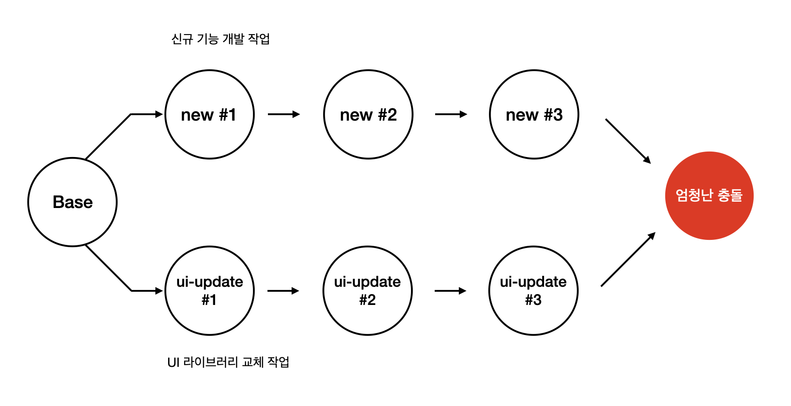
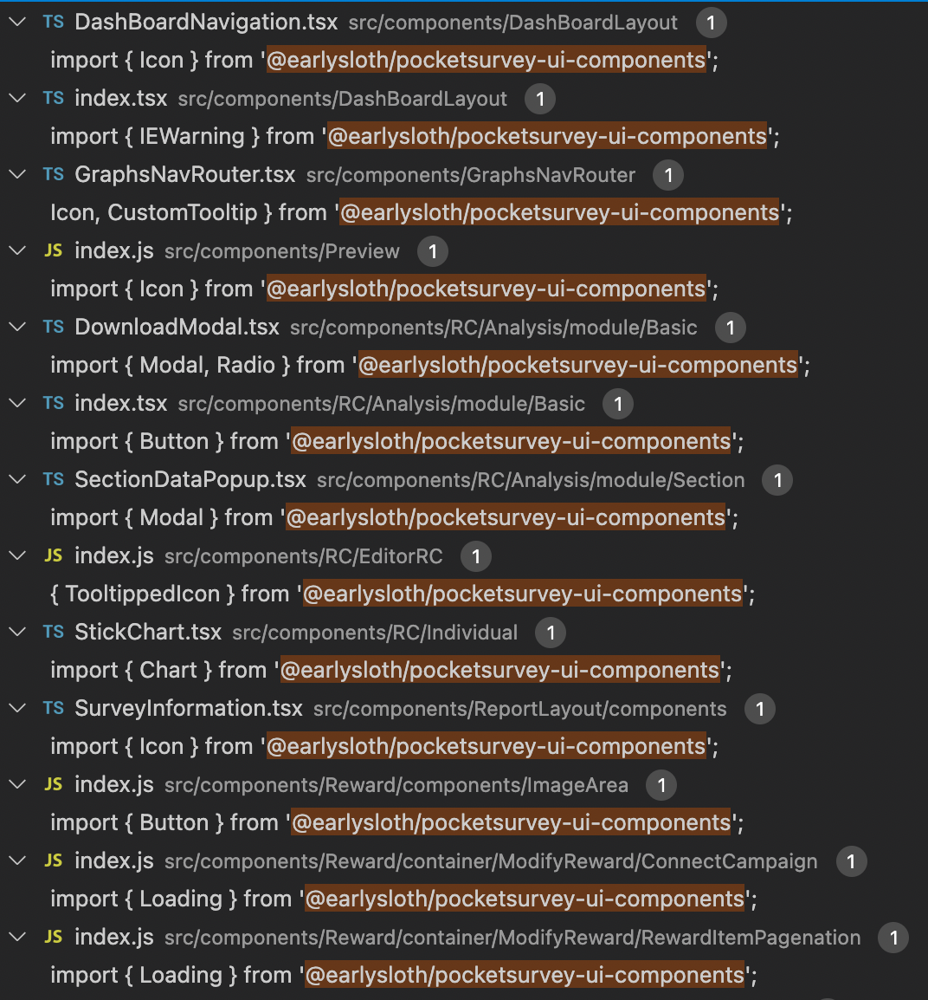
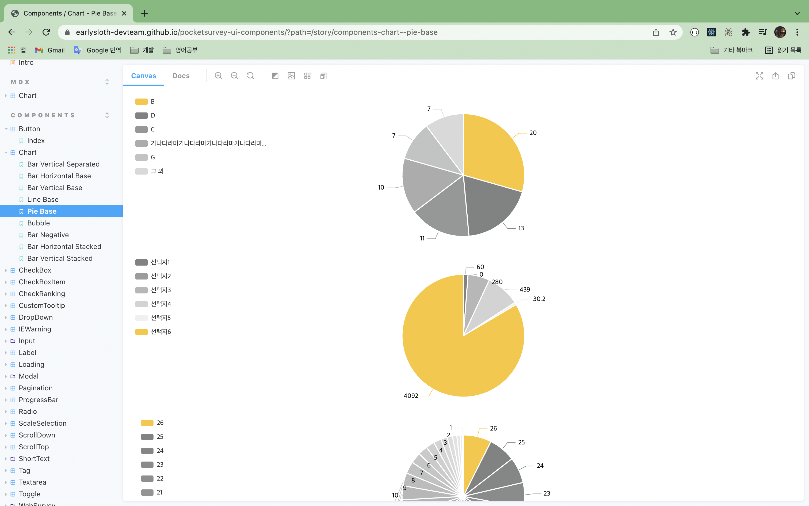

제가 얼리슬로스에 입사하고 1년 4~5개월 정도 되었을 때는 모든 개발 인력이 신규 기능 개발에 가담되어 있었습니다. 그러다보니 정말 빠른 속도로 기능이 개발되었는데요.

디자인 시스템이 없는 상태에서 개발 작업이 진행되다 보니까 컴포넌트 코드가 중복적으로 생기게 되었습니다.


보통 UI에 관련된 컴포넌트들이 중복적으로 사용되었고, 이렇게 작성된 중복적인 코드에 대해서 추후에 수정 작업을 할 때 엄청난 비용이 들었습니다. 수정 작업을 위한 비용을 줄이기 위해 중복 코드들을 줄여야 했고 관련된 솔루션을 찾다가 **UI 라이브러리, 디자인 시스템** 이라는 단어들을 알게 되었습니다.

해당 단어들을 가지고 검색을 조금 더 해본 결과, 자사 서비스를 개발하는 조직들은 거의 자사 디자인 시스템을 이용해서 UI 라이브러리를 만들어 사용한다는 것을 알게 되었습니다.


진행하던 개발 업무를 끝마치고, 저는 아래 효과들을 이끌어내기 위해 UI 라이브러리 제작 업무를 진행하였습니다.

1. UI에 관련된 개발 업무 단순화
2. 일관적인 UI / UX 제공
3. 커뮤니케이션 효과 증대

이 글에서는 어떤 순서로 UI 라이브러리 과업을 진행했는지 소개할 예정입니다.

# 타켓 컴포넌트 설정

제일 먼저 디자이너와 긴밀하게 협의한 후 라이브러리화 할 요소들을 정했습니다.

라이브러리화 할 요소의 조건은 아래와 같습니다.

1. UI에만 관여하는 요소일 것
2. 지금 당장 빠르게 만들 수 있을 정도로 가벼운 요소일 것


# 프로젝트 세팅

cra로 프로젝트를 만들고 storybook를 사용할 수 있게 세팅을 진행하였습니다.

<a href="https://velog.io/@velopert/start-storybook" target="_blank">storybook 세팅에 참고한 글</a>

# 컴포넌트 디자인

타겟 컴포넌트들에 대해 디자이너분이 새롭게 디자인해서 XD로 전달해주시면 저는 하나씩 받아서 디자인 작업을 진행하였습니다.


가장 간단한 Toggle 컴포넌트를 예시로 보여드리겠습니다. <a href="https://earlysloth-devteam.github.io/pocketsurvey-ui-components/?path=/story/components-toggle--index" target="_blank">Toggle 컴포넌트 storybook</a>

```javascript
import React from "react"
import styled from "styled-components"

type ToggleType = {
  toggleOnBackgroundColor: string;
  hoveredBackgroundColor: string;
  isToggleOn: boolean;
  setIsToggleOn: (isToggleOn: boolean) => void;
  className?: string;
  disable?: boolean;
};

function Toggle({
  toggleOnBackgroundColor,
  hoveredBackgroundColor,
  isToggleOn,
  setIsToggleOn,
  className,
  disable = false,
}: ToggleType): JSX.Element {
  return (
    <ToggleContainer
      backgroundColor={isToggleOn ? toggleOnBackgroundColor : "#d6d6d6"}
      hoveredBackgroundColor={hoveredBackgroundColor}
      isToggleOn={isToggleOn}
      onClick={() => {
        if (!disable) {
          setIsToggleOn(!isToggleOn)
        }
      }}
      data-testid="ToggleContainer"
      className={className}
      disable={disable}
    >
      <ToggleButton
        isToggleOn={isToggleOn}
        disable={disable}
      />
    </ToggleContainer>
  )
}

const ToggleContainer = styled.div<{
  ...
}>`
  ...
`
const ToggleButton = styled.div<{
  ...
}>`
  ...
`

export default Toggle;

```

코드에서 보시다시피 색상, 비활성화 유무(disable), 토글 상태, 토글 상태 업데이트 함수 등 컴포넌트 작동에 관련된 모든 값은 컴포넌트를 사용하는 쪽에서 props로 넘겨주게 만들었습니다.

디자인은 storybook으로 진행하였습니다.

# 프로젝트 번들링 & 배포

이 과정은 전적으로 <a href="https://velog.io/@velopert/bundle-with-rollup-and-publish-to-npm">Rollup을 사용하여 디자인 시스템 번들 후, npm 라이브러리로 배포하기</a> 포스팅을 따라서 진행하였습니다.

거의 똑같이 위 포스팅의 과정을 따라했기 때문에 다루지 않겠습니다.

# 포켓서베이 프로젝트에 적용

UI 라이브러리 과업이 일단락되어 적용시킬 일만 남았을 때, 포켓서베이 프로젝트에는 이미 중복적으로 쓰인 컴포넌트 코드가 전체 코드의 20~30%를 차지하고 있었습니다. 또한 저를 제외한 다른 개발자들은 신규 기능 개발 작업을 하고 있었는데요. 라이브러리를 만든 제가 교체 작업을 다 하더라도, 교체 작업과 신규 기능 개발 작업을 합칠 때 큰 충돌을 예상할 수 있었습니다.



UI 라이브러리 교체 방법에 대해 고민을 하던 중 문득 **병행**하자는 생각이 들었습니다.

신규 기능 개발을 하고있는 개발자분들이 작업을 하면서 교체 대상이 되는 코드들을 만났을 때, UI 라이브러리로 교체하는 작업을 **병행**하면 자연스럽게 점진적으로 포켓서베이 프로젝트에 UI 라이브러리 적용될 것이라고 생각했습니다.

그렇게 30분 정도 회의를 열어 UI 라이브러리 사용 방법에 대해서 설명을 하는 시간을 가졌고 결과적으로 약 1달이 조금 안되었을 때 UI 라이브러리가 거의 적용되는 효과를 볼 수 있었습니다.



# 계속적인 업데이트

2021년 2월에 공식적으로 시작한 UI 라이브러리 프로젝트는 그후로 계속 업데이트 되었습니다. 처음에 **타켓 컴포넌트 설정** 작업을 할 때 포함하지 않았던 차트, 로딩, 체크박스, 라디오 버튼 등 다양항 컴포넌트들이 추가되어 사용되고 있습니다.



# 마무리

평소에 얼리슬로스에서 작업을 할 때는 고객들을 위한 기능을 개발하는 작업들을 많이 했었습니다. 하지만 이 UI 라이브러리 작업을 한 이후로는 사내에 개발자들을 위한 작업들에 대한 비중이 점점 늘어났는데요. 바로 옆에 같이 일하는 사람이 제가 만든 기능으로 인해 편리해하는 것을 보면 마음이 참 좋아졌던 것 같습니다.