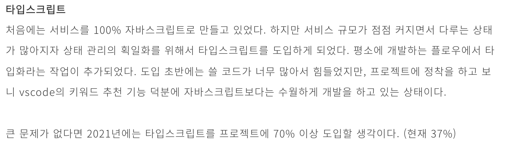

드디어 2021년이 지나고 2022년을 맞았습니다. 🎇

2021년에는 저에게 되게 많은 이벤트들이 있었습니다, 하지만 기록을 습관화하지 못해 기억에 의존하여 그 많은 이벤트들을 뒤늦게나마 열심히 기록하고 있는데요. 😅

이번 글에서는 연초에 목표했던 것들이 어떻게 진행되었는지, 2022년에는 어떤 목표를 이룰 것인지 새롭게 다짐하는 글을 써보려고 합니다!

# 2021년의 목표

## 포켓서베이 프로젝트 타입스크립트 70% 이상 만들기

2020년 회고글을 쓸 당시의 목표

지금 글을 쓰는 이 시점은 얼리슬로스를 퇴사하고 한 달이 지난 시점입니다. 현재는 프로젝트에서 차지하는 타입스크립트의 비중이 어느정도 되는지 확인하지는 못하지만, 마지막 날 기준으로는 63%로 측정되었습니다.

비중이 70%에 가깝게 높아지기는 했지만, 단순하게 타입스크립트 파일이 많아져서 그런 것도 있을 것 같습니다. 타입스크립트 기능들을 더 많이 공부해서 사용하였다면 참 좋았을 것 같은데, 그런 부분이 아쉽습니다.

## 월별로 회고글을 쓰는 습관을 가지기

2021년의 가장 큰 목표는 글 쓰는 습관을 가지는 것이었습니다. 기승전결이 완전한 15개 이상의 글은 가지고 싶었으나 이 회고 글 포함해서 6개밖에 작성하지 못했네요.

# 2021년의 이벤트

## 일... 계속 일...

고등학교 3학년 수능이 끝나고 11월 18일부터 입사해 현재까지 만으로 2년 1개월동안 회사를 다녔습니다. 구글 폼이나 타입 폼 같은 서베이 서비스를 하는 스타트업입니다.

그 시간동안 동안 사내 서베이 프로젝트를 하면서 정말 재미있었습니다. 정해진 회사의 로드맵을 잘 따라가기 위해 기능을 하나하나 추가하는 것이 정말 성취감이 컸습니다. 그 성취감을 위해서 2주동안 밤 늦게까지 철야를 한 적도 있고, 밤새 사무실에서 개발 업무를 한 적도 있었습니다. 2년 1개월동안 이 서베이 프로젝트가 저의 사업이라는 생각을 가지고 업무에 임했던 것 같습니다.

그렇게 정신없이 일에 몰두하다보니 업무를 하며 이뤄냈던 성과나 경험들을 기록하는 일은 하지 못했는데요, 지금 되돌아보았을 때는 정말 뼈 아픈 일입니다.

## 연봉 협상

처음으로 연봉 협상이라는 것을 해보았습니다. 지인의 추천으로 면접을 보게 되었고 그 회사에서 연봉 인상과 함께 오퍼레터를 받았습니다. 그리고 그 오퍼레터를 가지고 재직중인 회사의 대표님과 연봉 협상을 했습니다.

이 경험을 하기 전에는 제 역량에 대한 자신감도 많이 없었는데요, 조금이나마 생기는 계기가 되었습니다. 또한 개발자 시장에서 제가 경쟁력이 아예 없는 사람이 아니라는 것도 알았습니다.

## 골프

골프를 배웠습니다! 3개월 동안 레슨을 받고 지금은 100타 정도 칠 수 있게 되었습니다. 조금 더 갈고 닦아서 90타, 싱글까지도 쳐보고 싶은 욕심이 있습니다.

# 2022년 목표

## 알고리즘 문제풀이 역량 키우기

학생 때부터 오랫동안 품고있던 숙원입니다. 프로그래머스, 백준을 통해 여러 문제를 푸는 연습을 하지만 코딩 테스트를 보면 원하는 성적이 나오지 않아 항상 좌절하였습니다. 올해는 기필코 연습을 더 많이 해서 코딩 테스트에서 원하는 성적을 받고 싶습니다.

## 취업

개인적으로 취업하고싶은 회사가 있습니다. 그 회사의 개발자가 되기 위해서 준비해야하는 것들이 많습니다. 경력/성과 정리, 코딩 테스트 준비 등 잘 준비해서 꼭 그 회사에 들어가고 싶습니다.

## 블로그를 대표할만한 글 20개 이상 작성하기

개발에 관련된 특별한 경험들을 주제로 기승전결이 완전한 글을 20개 이상 써보고 싶습니다.