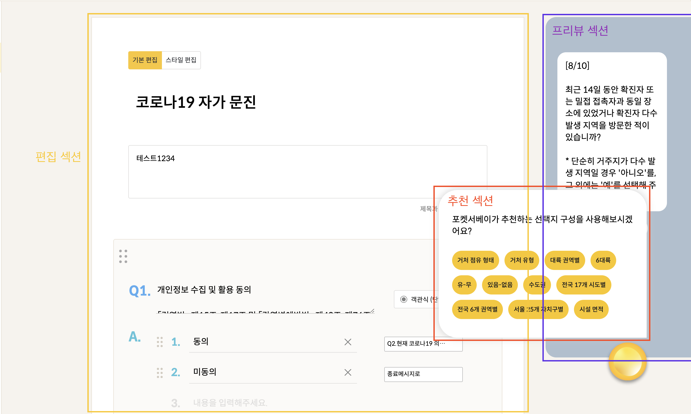
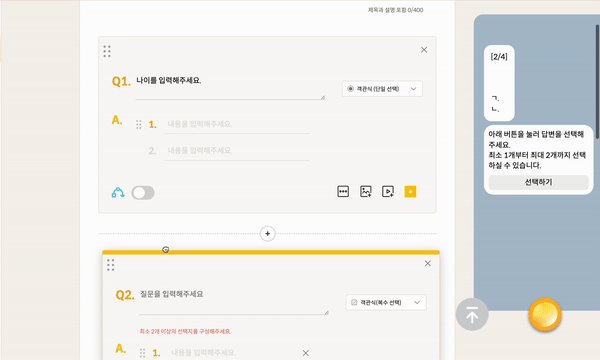

거의 모든 서베이 도구들은 자체 제작 빌더가 있습니다.


포켓서베이도 자체적인 설문 빌더가 있는데요.


이번 포스팅에서는 포켓서베이 설문 빌더의 기능들에 대해서 살펴보겠습니다.

# 섹션 분리

위 gif에서 보이는 것처럼 포켓서베이의 설문 빌더는 크게 편집 섹션, 추천 섹션, 프리뷰 섹션 이렇게 세 부분으로 나눌 수 있습니다.



# 편집 섹션

편집 섹션에는 **설문 제목, 설명을 편집할 수 있는 섹션**과 **문항을 편집할 수 있는 블록들**로 나뉩니다.

## 설문 제목, 설명을 편집할 수 있는 섹션

설문 설명, 제목은 기본 편집, 스타일 편집 이렇게 두가지 형식으로 편집할 수 있습니다.

### 기본 편집

설문 제목과 설명을 입력받는 섹션입니다. 설문 제목은 textarea로 입력받고 설문 설명은 input으로 입력받습니다. 기본 편집으로 편집한 설문 제목과 설명은 웹 기반 설문과 카카오톡 기반 설문 모두에서 표시됩니다.

### 스타일 편집


스타일 편집은 이미지 삽입, 텍스트 에디팅 기능을 지원합니다. 하지만 스타일 편집으로 편집한 설문 제목, 설명은 웹 기반 설문에서만 표시된다는 단점이 있습니다.

## 문항을 편집하는 블록들 (문항 컴포넌트)


문항 컴포넌트에서 가장 큰 비중을 차지하는 응답 모듈 부분을 먼저 보겠습니다.

### 응답 모듈

포켓서베이 설문의 문항은 여러 타입을 가집니다.

1. 객관식 단일 선택
2. 객관식 복수 선택
3. 객관식 이미지 선택
4. 주관식 입력
5. 설명 추가
6. 순위 설정

각 문항 타입마다 각기 다른 응답 모듈이 있습니다. 응답 모듈은 아래와 같이 생긴 친구들을 의미하는데요.


제일 왼쪽에 있는 모듈은 객관식 단일 선택 문항의 응답 모듈로, 설문 응답자가 선택할 수 있는 선택지를 만들기 위한 모듈입니다.

그 다음 오른편에 있는 모듈은 객관식 복수 문항의 응답 모듈입니다. 똑같이 선택지를 만드는 모듈이기에 객관식 단일 선택의 응답 모듈을 재사용할 수 있었지만, 복수 선택을 할 수 있는 문항이므로 선택의 제한을 설정하는 기능만 추가하였습니다.

그 다음에는 이미지를 선택지로 만들 수 있게 해주는 객관식 이미지 선택 문항의 응답 모듈입니다. 설문 응답자가 사진 선택지를 볼 수 있게 만드는 모듈입니다.

그 다음 아래쪽에 위치하는 주관식 문항의 응답 모듈은 설문 응답자가 자유롭게 응답할 수 있다는 것을 표현하는 모듈입니다. 주관식 문항에는 선택지가 필요없기에 이렇게 표시만 해주었습니다.

위 응답 모듈들이 아래 사진에 **문항 타입별로 바뀌는 부분**에 switch되어 렌더링됩니다.


코드로는 이렇게 작성되어 있습니다.

```javascript
const Question = () => {
  const switchAnswerComponent = (
    questionItem: TransformQuestionItemType,
    questionIndex: number
  ) => {
    switch (questionItem.type) {
      case 0:
        return <Radio />;
      case 1:
        return <Check />;
      case 2:
        return <RadioImageAnswer />;
      case 3:
        return <Shorttext />;
      case 4:
        return <SmallHeader />;
      case 5:
        return <Ranking />;
      default:
        return null;
    }
  };

  return (
    // 한 문항 블록
    <div className="question-components">
      ...
      {switchAnswerComponent(questionItem, questionIndex)}
      ...
    </div>
  );
};
```

### 문항 제목

문항 제목을 입력받는 textarea입니다.


### 문항 드래그, 문항 삭제

좌상단의 핸들러 아이콘을 드래그해서 문항 순서를 설정할 수 있습니다.

드래그 기능은 react-beautiful-dnd를 이용해서 구현하였습니다.



우상단의 문항 삭제 버튼을 문항을 삭제할 수 있습니다.

### 문항 타입 셀렉터

문항 타입 셀렉터를 이용해서 위에서 설명한 문항 타입들 중 하나를 선택할 수 있습니다.


### 브랜칭 토글

좌하단의 브랜칭 토글 컴포넌트를 이용해서 해당 문항에 브랜칭을 적용할 수 있습니다.

여기서 브랜칭이란 해당 선택지를 선택하면 어떤 문항으로 바로 점프하게 만드는 기능입니다.

브랜칭 토글을 키면 아래 영상처럼 선택지 우측에 문항을 선택할 수 있는 셀렉터가 나옵니다.


이 셀렉터는 현재 만들어진 문항의 제목들을 보여주고, 선택되면 해당 선택지와 선택한 문항을 브랜칭 데이터로 만들어주는 역할을 합니다.

### 문항 부가 기능

문항 부가 기능에서는

1. 기타 선택지 추가
2. 문항 이미지 추가
3. 문항 영상 추가
4. 필수 응답 여부 체크

총 네가지 기능을 제공합니다

**기타 선택지**는 객관식 단일, 객관식 복수에서만 사용할 수 있는 기능입니다. 설문 응답자가 만들어진 선택지 외의 내용을 선택하고 싶을 때 기타를 선택하게 만듭니다.

**문항 이미지, 영상 추가 기능**은 문항에 대해서 빠른 이해를 위해 미디어를 삽입하고 싶을 때 사용합니다. 영상은 유튜브 링크를 첨부해서 사용하게 됩니다.


문항에 **필수적으로** 응답해야 하는지 여부를 결정하는 버튼도 문항 부가 기능 섹션에 위치합니다.

# 추천 섹션

포켓서베이의 설문 빌더에는 추천 기능이 존재합니다. 추천 기능이란 문항 제목을 읽어서 문항 제목에 걸맞는 선택지를 추천하는 기능을 의미합니다.

"나이대를 입력해주세요"라는 문항 제목을 입력했을 때, 10대, 20대, 30대, 40대 ,,, 선택지가 자동으로 구성되는 것을 예시로 들 수 있겠네요.


이 기능을 완벽하게 구현하려면 인공지능 관련 기술을 이용해야 할 것으로 예상됩니다. 하지만 저는 그런 능력을 가지고 있지 않기에 문항 제목의 단어와 선택지를 연결해주는 사전을 만들었습니다.

문항 제목에 해당 사전에 있는 단어가 검색되면 그 단어와 연결되어있는 선택지 리스트를 반환하게 만들었습니다.


# 프리뷰 섹션

프리뷰 기능은 현재 선택한 문항이 모바일(카카오톡) 설문에서 어떻게 표시될 지 설문 제작자에게 알려주는 기능입니다.

현재 선택한 문항(currentQuestion)의 데이터를 가져와서 제목, 선택지 리스트를 표시합니다.


# 마무리

이렇게 포켓서베이의 설문 제작 기능에 대해서 사용법과 개발 흐름을 살펴보았습니다.
