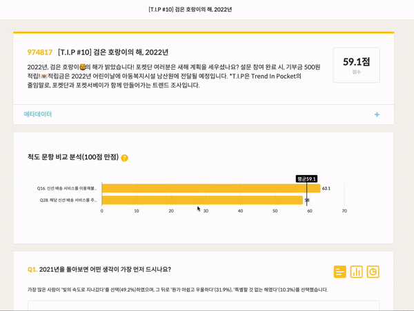
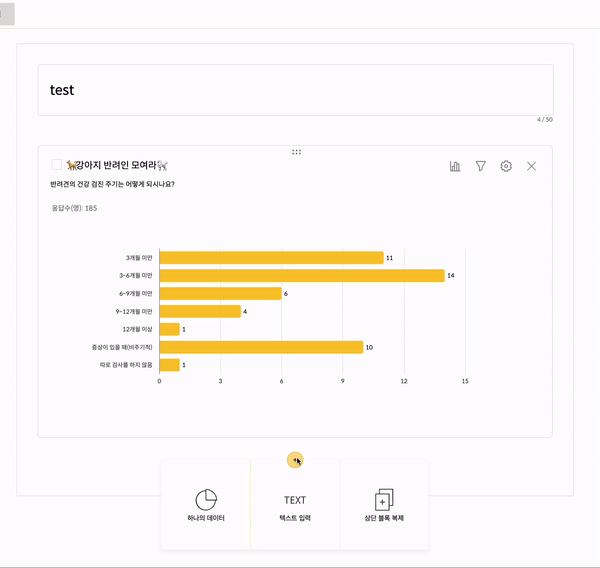
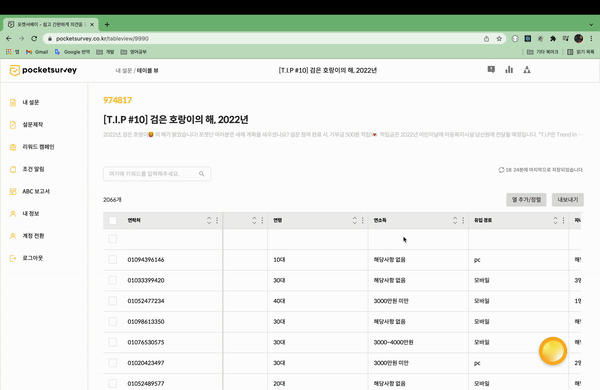
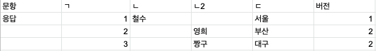

설문 응답이 분석 가능한 수준으로 쌓이면 서버에서는 응답 json 파일들을 읽어서 분석 데이터를 만듭니다. 그렇게 만들어진 분석 데이터는 프론트엔드의 다양한 곳에서 사용됩니다. 대표적으로 두 부분이 있는데요.

이 두 부분에 대해서는 별도 포스팅으로 자세하게 다루겠지만, 짤막하게 무슨 기능인지만 설명하겠습니다.

# 종합 보고서

포켓서베이에서 기본적으로 제공하는 형태의 보고서입니다. 설문 제작자의 별도 액션 없이, 응답 데이터가 쌓여 분석 데이터가 만들어지기만 한다면 사용할 수 있는 기능입니다.

전체적으로 어떤 응답이 얼만큼의 비중을 차지하는지 확인할 수 있습니다.



# 사용자 설정 보고서

설문 제작자가 서버에서 만들어준 분석 데이터를 이용해서 직접 차트를 만들 수 있게 하는 보고서입니다.



이렇게 포켓서베이에는 데이터를 시각화하는 기능이 두개가 있습니다.

# 테이블 뷰

이번에는 이 기능들과는 별개로 모인 응답 데이터들을 테이블 형태로 표시하고, 각종 필터나 정렬을 해서 원하는 정보를 얻을 수 있게하는 일명 `테이블 뷰` 프로젝트를 진행하게 되었습니다.

`테이블 뷰` 프로젝트에는 [react-table](https://react-table.tanstack.com/)이라는 라이브러리를 사용하였습니다.

react-table은 테이블에 사용되는 값과 옵션값을 넣었을 때, 각종 기능이 담긴 테이블을 만들어주는 라이브러리인데요. 정말 다양한 기능들이 제공되어서 이번 프로젝트에 알뜰하게 사용할 수 있었습니다.

이번 포스팅에서는 react-table의 사용기와 더불어 프로젝트 진행 과정을 코드와 함께 되돌아보는 글을 써보도록 하겠습니다.



# 프로젝트 고려 사항

테이블 뷰 프로젝트에는 가장 중요한 목표 3가지가 있습니다.

1. 모든 버전에 대한 응답들이 테이블에 표시되어야 함
2. 모든 속성에 대해서 정렬, 필터 기능이 잘 작동해야 함
3. 마지막으로 수정한 테이블의 형태가 유지되어야 함

이 3가지 목표들을 기준으로 상세한 개발 과정을 살펴보겠습니다.

# 모든 버전에 대한 응답들이 테이블에 표시되어야 함

처음에 이 요구사항을 들었을 때 "다른 버전의 설문 응답 데이터는 어떻게 표시해야 하지?" 라는 의문이 생겼습니다.

> 포켓서베이 설문에는 `버전`이라는 개념이 있습니다. `버전`은 정수로 표현되고, 설문의 내용이 바뀔때마다 1씩 올라갑니다. `버전`이 존재하기 때문에 설문의 내용이 수정되어도 설문이 수정되기 전의 분석 데이터는 유지할 수 있습니다.

예를 들어 1버전인 A설문에 ㄱ,ㄴ,ㄷ 이라는 문항이 있고 2버전인 A설문에 ㄱ,ㄹ,ㅁ 이라는 문항이 있다고 가정하겠습니다.

이렇게 여러 버전이 있는 설문 응답을 한 테이블에 표시하기 위해서는 한개의 열로 만들어야 합니다.


## 방법

그냥 보기에는 중복값을 없애서 합치면 되지만, 1버전 설문의 ㄱ문항과 2버전 설문의 ㄱ문항을 식별할 수 있어야 하기 때문에 별도의 병합 함수를 만들었습니다.

```typescript
interface TableViewInfoType {
  ...
  headers_info: [
    {
      [key: string]: {
        question_order: number;
        version: number;
      };
    },
  ] | [];
  ...
}

function makeOriginHeaderList(tableViewInfo: TableViewInfoType) {
  try {
    const questionHeaders = tableViewInfo.headers_info;
    let questionHeaderList: HeaderType[] = [];
    
    for (let questionHeaderIndex = 0; questionHeaderIndex < questionHeaders.length; questionHeaderIndex += 1) {
      const item = questionHeaders[questionHeaderIndex]

      const questionTitle = Object.keys(item)[0];
      const { version, question_order } = item[questionTitle];

      if (
        questionHeaderList.some(
          (headerItem) => headerItem.headerName === questionTitle,
        )
      ) {
        questionHeaderList = questionHeaderList.map((headerItem) => {
          if (headerItem.headerName === questionTitle) {
            return {
              ...headerItem,
              included: headerItem.included.concat([
                [version, question_order],
              ]),
            };
          }
          return headerItem;
        });
      } else {
        questionHeaderList.push({
          headerName: questionTitle,
          included: [[version, question_order]],
        });
      }
    }

    return questionHeaderList;
  } catch (e) {
    console.error(e);
  }
}
```

makeOriginHeaderList 함수에 서버로부터 전달되는 headers_info 데이터를 던지면 각 문항이 어떤 버전에 포함되는지에 대한 정보와 함께 모든 문항의 제목이 1차원 배열로 정리되어 반환됩니다.

왜 굳이 문항 제목을 열 이름으로 둔 것일까요? 응답값이 어떤 문항의 응답값인지 한 번에 알아차리기 위해서도 있지만, 응답 데이터를 테이블의 row로 붙히기 쉬워져서 그런것도 있습니다. 자세한 내용은 아래 섹션에서 설명드리겠습니다.

## 실제 응답 데이터 표현 방법

react-table을 이용해서 실제 테이블을 표현하는 방법을 알아보겠습니다.

```javascript
function App() {
  const columns = React.useMemo(
    () => [
      {
        Header: 'Name',
        columns: [
          {
            Header: 'First Name',
            accessor: 'firstName',
          },
          {
            Header: 'Last Name',
            accessor: 'lastName',
          },
        ],
      },
      {
        Header: 'Info',
        columns: [
          {
            Header: 'Age',
            accessor: 'age',
          },
        ],
      },
    ],
    []
  )

  const data = [
    {
      firstName: '웅연',
      lastName: '조',
      age: 200
    },
    {
      firstName: 'woongyeon',
      lastName: 'jo',
      age: 99
    }
  ]

  return (
    <Styles>
      <Table columns={columns} data={data} />
    </Styles>
  )
}
```

react-table에서는 이렇게 columns에 있는 accessor의 값을 data배열의 각 객체의 키로 넣어주면 값이 자동으로 잡힙니다. 이 성질을 이용해서 문항 제목을 accessor로 두고 기준열을 만드는 작업을 했던 것입니다. 응답값을 테이블의 row로 만드는 것이 쉬우면서, 열 이름에 표시하면 어떤 문항의 응답값인지 바로 확인이 가능한 1석2조의 효과가 있기 때문입니다.

## 현재 이 코드가 가지고 있는 맹점

1버전에 ㄱ,ㄴ,ㄷ 문항이 존재하고, 2버전에 ㄱ,ㄴ2,ㄷ 문항이 존재한다고 가정해 보겠습니다. ㄴ2의 의미는 문항 제목의 형태가 달라졌을 뿐, 질문 의도는 ㄴ과 같다는 것을 의미합니다. 예를 들어 "이름을 적어주세요"와 "성함을 입력해주세요"가 있겠네요.

만약 현재 makeOriginHeaderList 함수로 기준열을 만든다면 ㄱ,ㄴ,ㄴ2,ㄷ 으로 만들어질 것입니다. 하지만 응답값을 본다면 아래 사진과 같이 테이블이 만들어질 것입니다.



이런 경우 사용자는 상식적으로 이름 응답값들이 같은 열에 있어야 한다는 생각을 할 것입니다. 하지만 현재 makeOriginHeaderList 함수는 **질문 의도를 파악해서 같은 문항으로 처리**하는 작업을 수행하지 못하는 상태입니다.

이 맹점에 대한 해결책으로 ㄴ, ㄴ2 간에 유사도를 측정해서 특정 조건에 부합한다면 같은 문항으로 취합하는 작업이 필요할 것으로 보입니다.

# 정렬, 필터 기능이 작동해야 함

# 테이블의 형태가 유지되어야 함
