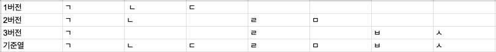

설문 응답이 분석 가능한 수준으로 쌓이면 서버에서는 응답 json 파일들을 읽어서 분석 데이터를 만듭니다. 그렇게 만들어진 분석 데이터는 프론트엔드의 다양한 곳에서 사용됩니다. 대표적으로 두 부분이 있는데요.

이 두 부분에 대해서는 별도 포스팅으로 자세하게 다루겠지만, 짤막하게 무슨 기능인지만 설명하겠습니다.

# 종합 보고서

포켓서베이에서 기본적으로 제공하는 형태의 보고서입니다. 설문 제작자의 별도 액션 없이, 응답 데이터가 쌓여 분석 데이터가 만들어지기만 한다면 사용할 수 있는 기능입니다.

전체적으로 어떤 응답이 얼만큼의 비중을 차지하는지 확인할 수 있습니다.


# 사용자 설정 보고서

설문 제작자가 서버에서 만들어준 분석 데이터를 이용해서 직접 차트를 만들 수 있게 하는 보고서입니다.


이렇게 포켓서베이에는 데이터를 시각화하는 기능이 두 개가 있습니다.

# 테이블 뷰

두 기능들과는 별개로, 모인 응답 데이터들을 테이블 형태로 표시하고, 각종 필터나 정렬을 해서 원하는 정보를 얻을 수 있게 하는 일명 `테이블 뷰` 프로젝트를 진행하게 되었는데요.

`테이블 뷰` 프로젝트에는 [react-table](https://react-table.tanstack.com/)이라는 라이브러리를 사용하였습니다.

react-table은 테이블에 사용되는 값과 옵션 값을 넣었을 때, 각종 기능이 담긴 테이블을 만들어주는 라이브러리인데요. 정말 다양한 기능들이 제공되어서 이번 프로젝트에 알뜰하게 사용할 수 있었습니다.

이번 포스팅에서는 react-table의 사용기와 더불어 프로젝트 진행 과정을 코드와 함께 되돌아보는 글을 써보도록 하겠습니다.


# 프로젝트 고려 사항

테이블 뷰 프로젝트에는 가장 중요한 목표 3가지가 있습니다.

1. 모든 버전에 대한 응답들이 테이블에 표시되어야 함
2. 정렬, 필터 기능이 작동해야 함
3. 테이블의 형태가 유지되어야 함

이 3가지 목표들을 어떤 개발 과정을 거쳐서 달성하였는지에 대해서 살펴보겠습니다.

# 모든 버전에 대한 응답들이 테이블에 표시되어야 함

## 문제 제기

처음에 이 요구사항을 들었을 때 "다른 버전의 설문 응답 데이터는 어떻게 표시해야 하지?"라는 의문이 생겼습니다.

> 포켓서베이 설문에는 `버전`이라는 개념이 있습니다. `버전`은 정수로 표현되고, 설문의 내용이 바뀔 때마다 1씩 올라갑니다. `버전`이 존재하기 때문에 설문의 내용이 수정되어도 설문이 수정되기 전의 분석 데이터는 유지할 수 있습니다.

예를 들어 1버전인 A 설문에 ㄱ,ㄴ,ㄷ 이라는 문항이 있고 2버전인 A 설문에 ㄱ,ㄹ,ㅁ 이라는 문항이 있다고 가정하겠습니다. 응답 데이터를 테이블로 표현하려면 모든 버전의 모든 문항이 한 열에 표시되어야 하는데요. 이것을 구현하는 과정에서 한 가지 걸림돌이 있었습니다.



## 문제 해결 과정

그냥 보기에는 모든 버전의 모든 문항들을 배열에 넣고 중복 값을 없애면 될 것이라고 생각했습니다. 하지만 1버전 설문의 ㄱ문항과 2버전 설문의 ㄱ문항을 식별할 수 있어야 하기 때문에 해당 문항이 어떤 버전에 속하는지 표시하면서 합치는 별도 함수를 만들었습니다.

```typescript
interface TableViewInfoType {
  ...
  headers_info: [
    {
      [key: string]: {
        question_order: number;
        version: number;
      };
    },
  ] | [];
  ...
}

function makeOriginHeaderList(tableViewInfo: TableViewInfoType) {
  try {
    const questionHeaders = tableViewInfo.headers_info;
    let questionHeaderList: HeaderType[] = [];

    for (let questionHeaderIndex = 0; questionHeaderIndex < questionHeaders.length; questionHeaderIndex += 1) {
      const item = questionHeaders[questionHeaderIndex]

      const questionTitle = Object.keys(item)[0];
      const { version, question_order } = item[questionTitle];

      if (
        questionHeaderList.some(
          (headerItem) => headerItem.headerName === questionTitle,
        )
      ) {
        questionHeaderList = questionHeaderList.map((headerItem) => {
          if (headerItem.headerName === questionTitle) {
            return {
              ...headerItem,
              included: headerItem.included.concat([
                [version, question_order],
              ]),
            };
          }
          return headerItem;
        });
      } else {
        questionHeaderList.push({
          headerName: questionTitle,
          included: [[version, question_order]],
        });
      }
    }

    return questionHeaderList;
  } catch (e) {
    console.error(e);
  }
}
```

makeOriginHeaderList 함수에 서버로부터 전달되는 headers_info 데이터를 던지면 각 문항이 어떤 버전에 포함되는지에 대한 정보와 함께 모든 문항의 제목이 1차원 배열로 정리되어 반환됩니다.

왜 굳이 문항 제목을 열 이름으로 둔 것일까요? 응답 값이 어떤 문항의 응답 값인지 한 번에 알아차리기 위해서도 있지만, 응답 데이터를 테이블의 row로 붙이기 쉬워져서 그런것도 있습니다. 자세한 내용은 아래 섹션에서 설명드리겠습니다.

## 실제 응답 데이터 표현 방법

react-table을 이용해서 실제 테이블을 표현하는 방법을 알아보겠습니다.

```javascript
function App() {
  const columns = React.useMemo(
    () => [
      {
        Header: "Name",
        columns: [
          {
            Header: "First Name",
            accessor: "firstName",
          },
          {
            Header: "Last Name",
            accessor: "lastName",
          },
        ],
      },
      {
        Header: "Info",
        columns: [
          {
            Header: "Age",
            accessor: "age",
          },
        ],
      },
    ],
    []
  );

  const data = [
    {
      firstName: "웅연",
      lastName: "조",
      age: 200,
    },
    {
      firstName: "woongyeon",
      lastName: "jo",
      age: 99,
    },
  ];

  return (
    <Styles>
      <Table columns={columns} data={data} />
    </Styles>
  );
}
```

react-table에서는 이렇게 columns에 있는 accessor의 값을 data 배열의 각 객체의 키로 넣어주면 값이 자동으로 잡힙니다. 이 성질을 이용해서 문항 제목을 accessor로 두고 기준열을 만드는 작업을 했던 것입니다. row를 만드는 것이 쉬우면서, 열 이름에 표시하면 어떤 문항의 응답 값인지 바로 확인이 가능한 일석이조의 효과가 있기 때문입니다.

## 현재 이 코드가 가지고 있는 맹점

1버전에 ㄱ,ㄴ,ㄷ 문항이 존재하고, 2버전에 ㄱ,ㄴ2,ㄷ 문항이 존재한다고 가정해 보겠습니다. ㄴ2의 의미는 문항 제목의 형태가 달라졌을 뿐, 질문 의도는 ㄴ과 같다는 것을 의미합니다. 예를 들어 "이름을 적어주세요"와 "성함을 입력해 주세요"가 있겠네요.

만약 현재 makeOriginHeaderList 함수로 기준열을 만든다면 ㄱ,ㄴ,ㄴ2,ㄷ 으로 만들어질 것입니다. 하지만 응답 값을 본다면 아래 사진과 같이 테이블이 만들어질 것입니다.


이런 경우 사용자는 상식적으로 이름 응답 값들이 같은 열에 있어야 한다는 생각을 할 것입니다. 하지만 현재 makeOriginHeaderList 함수는 **질문 의도를 파악해서 같은 문항으로 처리**하는 작업을 수행하지 못하는 상태입니다.

이 맹점에 대한 해결책으로 ㄴ, ㄴ2 간에 유사도를 측정해서 특정 조건에 부합한다면 같은 문항으로 취합하는 작업이 필요할 것으로 보입니다.

# 정렬, 필터 기능이 작동해야 함

"나이를 입력하세요"라는 문항의 응답 값을 정렬해서 본다거나, "성별을 선택해주세요"라는 문항의 응답 값을 남성으로 필터링해서 남성들의 응답 값을 보고 싶다거나 그런 경우를 위해서 모든 문항에 대해서 정렬, 필터 기능이 동작해야 합니다.

react-table에서는 정렬과 필터 기능을 기본적으로 제공하는데요. 어떻게 사용하는지 코드로 살펴보겠습니다.

```javascript
import { useTable, useFilters, useSortBy } from "react-table";

const props = useTable(
  {
    columns: memoizedColumns,
    data: memoizedData,
    ...
  },
  useFilters,
  useSortBy,
  ...
);

const memoizedColumns = useMemo(
  () =>
    tableHeader.map((item) => {
      const Filter = filterSwitcher(item);

      return {
        Header: "테이블에 표시되는 열 이름"
        accessor: "데이터를 끌어오기 위한 키값",
        Filter,
      };
    }),
  [tableHeader],
);
```

react-table에서 제공하는 useFilters와 useSortBy를 useTable 안에 인자로 넘겨주면 해당 기능들을 구현하기 위한 준비가 됩니다.

## 필터

useFilters를 인자로 넘기면 props 안에 columns에 Filter라는 값을 넣을 수 있게 되는데, 여기에는 JSX를 넘길 수 있습니다. 그렇기 때문에 각 열마다 다른 모양의 필터 컴포넌트를 띄울 수 있습니다. 아래 gif처럼요.


Filter에 넘기는 컴포넌트에는 자동으로 필터링 관련 함수들이 props로 전달됩니다. 여기서 전달되는 filterValue로 현재 걸려있는 필터 상태를 조회할 수 있고, setFilter를 이용해서 필터를 수정할 수 있습니다.

아래 코드는 객관식 복수 선택 문항에 필터를 걸 때 나오는 컴포넌트입니다.

```javascript
function RadioCheckColumnFilter({
  column: { filterValue, setFilter, preFilteredRows, id },
}: ColumnFilterPropertiesType) {
  ...
}
```

이러한 구조로 다양한 문항 타입에 대응이 되는 필터링 기능을 구현하였습니다.

## 정렬

보통 react-table로 테이블을 만들 때

```jsx
<table {...getTableProps()}>
  <thead>
    {headerGroups.map((headerGroup) => (
      <tr {...headerGroup.getHeaderGroupProps()}>
        {headerGroup.headers.map((column) => (
          <th {...column.getHeaderProps()}>{column.render("Header")}</th>
        ))}
      </tr>
    ))}
  </thead>
  ...
</table>
```

이렇게 headerGroups를 이용해서 헤더를 만드는데요. useTable을 실행할 때 useSortBy를 인자로 넘기면 column 안에 getSortByToggleProps라는 함수가 생겨납니다.

getSortByToggleProps 함수는 클릭 시 데이터의 정렬 값이 오름차순, 내림차순, 기본 중 하나로 설정되게 하는 함수입니다.

위 코드에서

```jsx
<th {...column.getHeaderProps()}>{column.render("Header")}</th>
```

를

```jsx
<th {...column.getHeaderProps(column.getSortByToggleProps())}>
  {column.render("Header")}
</th>
```

로 바꾸면 헤더를 클릭할때마다 정렬값이 바뀌게 됩니다.

이런 방식으로 정렬 기능을 구현하였습니다.

# 테이블의 형태가 유지되어야 함

설문 제작자는 이렇게 만들어진 테이블을 보면서 필요한 정보를 얻기 위해 정렬이나, 필터 기능을 이용할 것입니다. 한 번 설정한 정렬, 필터값을 계속 유지시키기 위해서는 현재 테이블의 설정값을 가져올 수 있어야 합니다.

```javascript
import { useTable } from "react-table";

const props = useTable(
  {
    initialState: {},
    columns: memoizedColumns,
    data: memoizedData,
    ...
  },
  ...
);

props.state // 테이블 설정값
```

react-table은 테이블의 설정값을 저장하는 state를 제공합니다.

이 설정값이 바뀔 때마다 서버에 저장하고,

```javascript
React.useEffect(() => {
  try {
    setIsSaving(true);

    setTimeout(() => {
      tableViewService
        .fetchTableViewJson(blueprint.survey_id, email, data)
        .then(() => {
          setIsSaving(false);
        });
    }, 1000);
  } catch {
    setIsSaving("error");
  }
}, [props.state]);
```

새롭게 로드할 때는 저장된 테이블 설정값을 initialState에 넣어줌으로써 테이블의 형태를 유지시켰습니다.


# 마무리

이렇게 react-table이라는 라이브러리를 사용해서 포켓서베이의 테이블 뷰 기능을 구현해 보았습니다. 정렬, 필터 기능부터 설정값 저장 기능까지 여러모로 테이블 뷰의 요구사항에 딱 맞는 라이브러리였던 것 같습니다.

react-table에는 정렬, 필터 이외에도 글로벌 필터, 열 크기 리사이징, 페이지네이션 테이블에 관련되어 있는 여러 부가기능들이 제공되고 있는데요, 테이블 뷰에서도 사용하고 있지만 단순하게 기능을 키고 끄는 작업밖에 할 게 없어서, 이번 포스팅에서는 제외하였습니다.