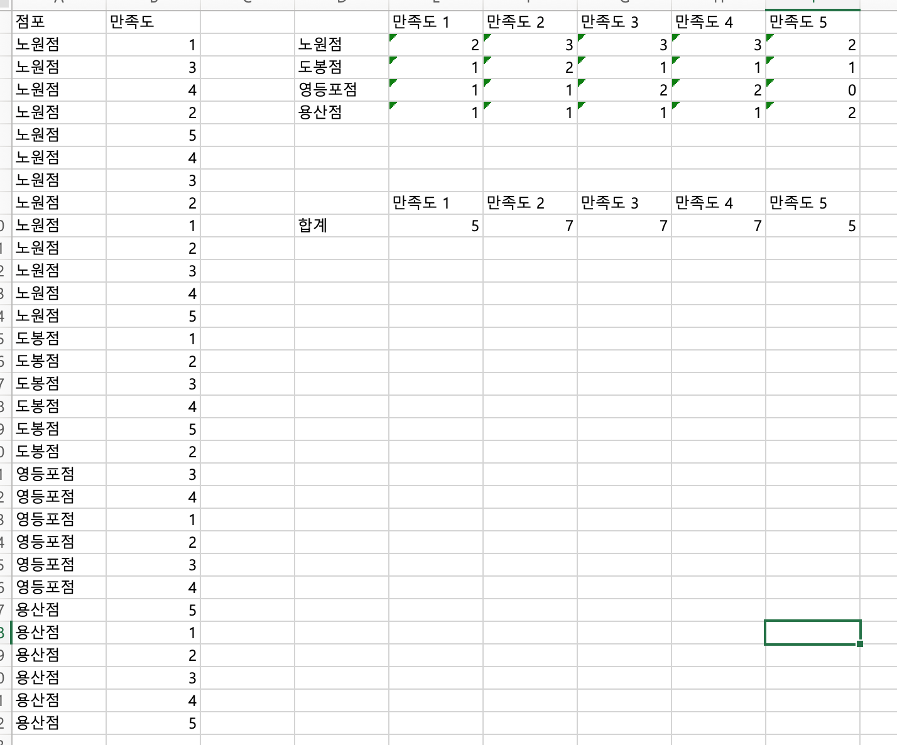
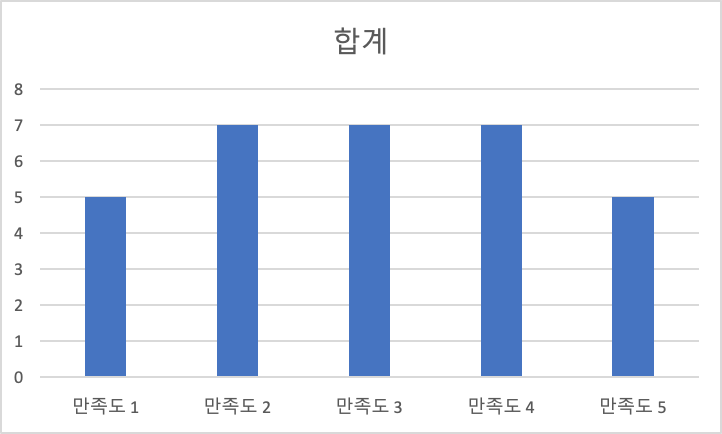
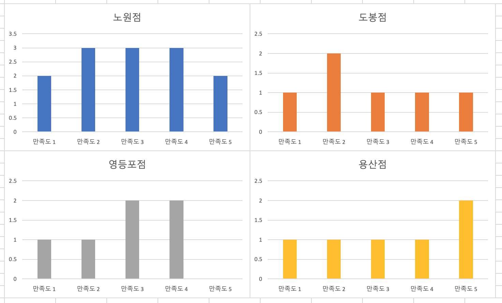
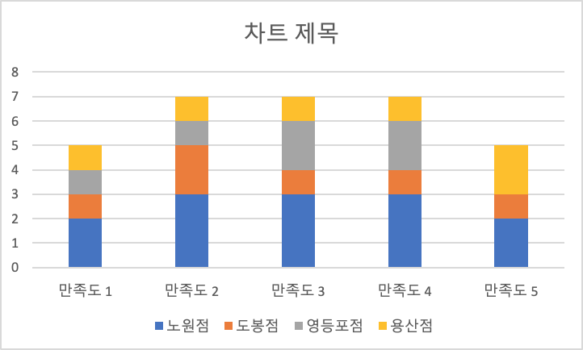
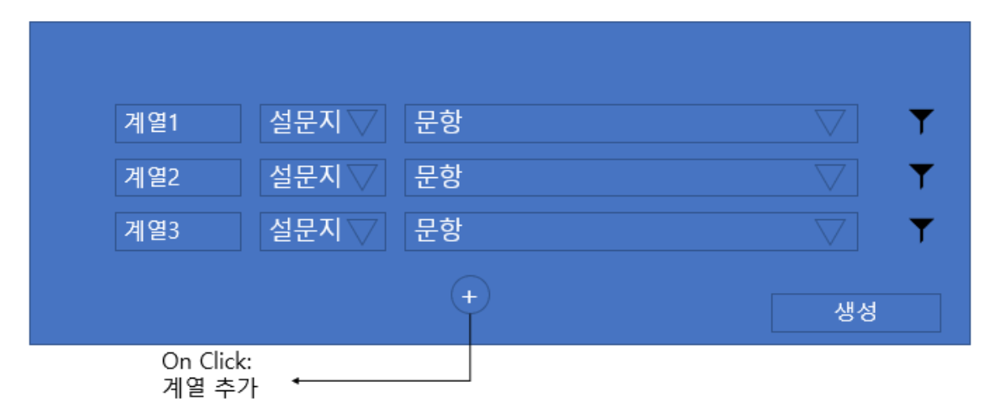

_포켓서베이의 기존 설문 분석 기능은 정해진 형식 내에서 각 문항의 분석 값이 나오는데, 사용자 커스텀 분석 보고서 기능은 설문 진행자가 원하는 형식의 보고서를 제작할 수 있다._

_개발을 하며 이 프로젝트를 **샌드박스 보고서** 프로젝트라고 불렀다._

---

샌드박스 보고서는 블록의 집합으로 만들어지는데, 만들 수 있는 블록의 종류는 이러하다

- 한 문항에 대한 차트 블록 (일반 블록)
- 여러 문항에 대한 차트 블록 (비교 블록)
- 일반 텍스트 블록 (텍스트 블록)

사용자는 위 블록들을 생성함으로써 하나의 보고서를 만드는 흐름으로 이 기능을 이용하게 된다.

조금 더 구체적으로 사용 영상을 보고싶으시다면 아래 영상을 참조하시면 된다.

[샌드박스 리포트 사용 영상.mov](https://drive.google.com/file/d/1mOdwPUf0acVkgePiNigSn38zGEOCSrSa/view?usp=drivesdk)

사용자 측면에서 중요하게 생각할 부분은 **어떤 보고서를 만들 수 있는지** 일 것이다. 지금부터 그 예시를 들어가며 샌드박스 보고서의 특징을 짚어보겠다.

---

### 일반 블록으로 이루어진 보고서

일반 블록은 한 문항에 대한 통계값을 보여준다.

- 자동차 정비소의 만족도 조사 설문에서 불만족한 이유에 대한 통계
  (아무것도 설정하지 않은 기본 일반 블록)
- 노원구 점포를 이용한 고객들의 불만족 이유에 대한 통계
  (데이터 필터를 설정한 일반 블록)
- 4월 1일부터 4월 31일 동안 노원구 점포를 이용한 고객들의 불만족 이유에 대한 통계
  (기간 설정, 데이터 필터를 설정한 일반 블록)

### 비교 블록으로 이루어진 보고서

비교 블록은 일반 블록 2개 이상을 합쳐서 만든다.

- 4월 전체 만족도, 5월 전체 만족도, 6월 전체 만족도를 한눈에 비교하고 싶을 때
  각 월별로 기간 설정을 한 일반 블록을 3개 만든 뒤에 합치면 된다.
- 노원구 만족도, 도봉구 만족도, 용산구 만족도를 만들고 싶을 때
  각 지점별로 데이터 필터를 걸어서 만든 일반 블록 3개를 만든 뒤에 합치면 된다.
- 모든 지점 별 전체 만족도를 보고싶을 때는. 지점 종류가 나온 일반 블록과 전체 만족도 일반 블록을 합치면 된다

### 텍스트 블록으로 이루어진 보고서

- 텍스트 블록은 말 그대로 텍스트를 쓸 수 있는 블록으로, 마크다운처럼 정해진 형식대로 글을 쓸 수 있는 공간이다.

---

## 조금 더 구체적인 사례

이런 모양의 데이터가 수집되었다고 가정했을 때. 일반 블록으로 전체 만족도를 표현하면 위 차트가 만들어진다

이제 각 점포별로 데이터 필터를 걸어서 일반 블록으로 만들면

이런 모양의 일반 블록이 4개가 만들어진다. 이 블록들을 합치면 비교 블록이 되고, 위 차트처럼 여러 계열이 합쳐진 차트가 나온다.

---

## 개발 중 어려웠던 점

### 개발 계획 문서 쓰기

우리 조직의 개발팀이 받는 기능 개발 기획서는 내용이 사전처럼 산발적이다. 흐름이 없이 기록되어있기 때문에 개발을 진행할 때 이 기획서를 참조하면 집중도가 떨어지는 느낌을 많이 받았다. 나는 어떤 흐름을 따라 작업을 진행하고 싶었기 때문에 개발 계획 문서를 따로 작성하는 시간을 가졌다. 이렇게 하니까 작업을 할 때 분업과 병합이 잘 되었다. 이는 자연스럽게 커뮤니케이션 효율이 높아지는 결과를 만들었다.

### 비교 블록

이 프로젝트는 **일반 블록 만들기, 비교 블록 만들기** 두 단계로 나눠서 진행하였다. 일반 블록 같은 경우는 한 문항에 대해서 차트 데이터를 불러오고 블록 안에 차트를 렌더링하면 끝나는 것이라 어렵지 않았다.

비교 블록은 _"어떻게 비교 블록을 생성할 것이냐"_ 부터 문제가 있었다.

이런 모양으로 비교 블록을 만들기로 기획이 되었는데, 되게 불편할 것 같았다. 그래서 나온 다른 방법은 _"일반 블록을 조인해서 비교 블록을 만들자!"_ 였다. 이 방법은 매우 직관적이여서 좋았다 또한 이미 만들어져 있는 일반 블록의 데이터 구조를 이용해서 개발하면 되기 때문에 개발 시간도 줄일 수 있었다.
