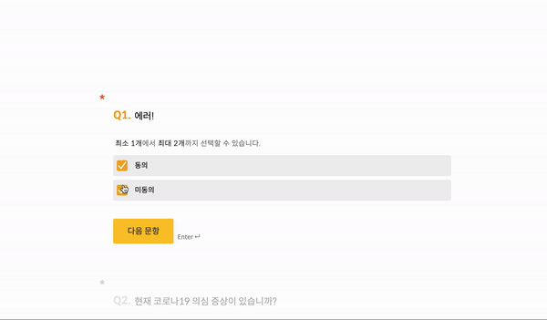
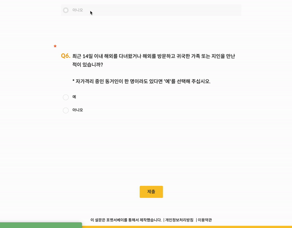
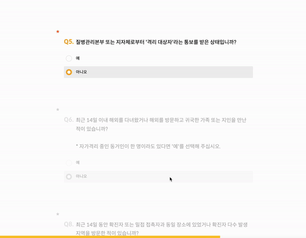
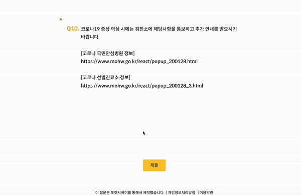

<!--
  * 어떤 고려사항을 바탕으로 작업을 진행했는지
  * 사용한 기술이 비즈니스에 어떻게 엮여 있는지
-->

웹 설문이 만들어지기 이전의 포켓서베이는 **카카오톡 환경에서만** 설문을 진행할 수 있었습니다. **카카오톡 환경 설문의 치명적인 단점**은 설문을 진행하기 위해서 발송 과정을 꼭 거쳐야만 한다는 것입니다. **발송 과정**은 설문을 받아볼 사람의 전화번호나 이름을 기입하고 포켓서베이 발송 API를 호출하는 과정입니다. 이런 중간 과정이 있다 보니 쉽고 빠르게 설문을 공유하려는 개인 고객이 사용을 꺼려 하는 케이스가 있었습니다.

이를 위한 대안으로 구글 폼, 서베이 몽키, 타입폼과같은 자체 설문 진행 애플리케이션을 만들었습니다.

이 글에서는 포켓서베이 웹 설문의 특별한 기능들을 어떻게 개발하였는지 코드와 함께 살펴보려고 합니다.

# 포켓서베이 웹 설문의 특별한 기능들

포켓서베이 웹 설문의 특별한 기능들을 소개하고 그것들을 **왜** 개발해야 하는지에 관한 짤막한 설명과 함께 글을 시작하겠습니다.

1. 브랜칭을 고려해서 문항을 표시하는 기능
2. 문항 포커싱 기능 만들기

## 브랜칭을 고려해서 문항을 표시하기

포켓서베이의 설문 제작 페이지에는 응답자의 응답에 따라서 다른 문항을 나오게 하는 `브랜칭` 기능이 존재합니다. 이 브랜칭이 적용되어 있는 설문에 응답을 할 때는 브랜칭 로직에 맞는 문항들이 표시되어야 하는데요, 이 브랜칭 기능을 고려하여 문항을 표시하기 위해 약간의 고민이 필요했습니다.

## 문항 포커싱

폼 서비스에서 문항을 표시하는 방법은 보편적으로 두 가지가 있습니다.

1. 여러 문항을 한 페이지에 모두 표시하는 방법. 

2. 한 페이지에 한 문항씩 보이게 한 다음, 응답이 이뤄지면 다음 페이지를 표시하는 방법. 

포켓서베이는 응답자가 전체 설문이 어떤 구조로 이뤄져 있는지 파악하기 쉽게 만들기 위해서 **전자**의 방법을 선택해 개발하였습니다.

만약 문항을 표시를 후자의 방법으로 했다면 이 기능을 넣을 필요는 없었을 것입니다. 여러 문항을 한 번에 표시함으로 인해 사용자가 지금 어떤 문항을 보고 있는지 표시해 줄 필요가 생겼습니다.

# 개발 과정

자, 그러면 각 특별한 기능들이 어떤 과정으로 만들어졌는지 상세하게 살펴보겠습니다.

## 브랜칭을 고려해서 문항을 표시하기

처음에는 단순하게

```JSX
<QuestionContainer>
  {scenario.contents.body.map((item, index) => {
    return switchingQuestionModules(item, index)
  })}
</QuestionContainer>
```

을 하면서 모든 문항 컴포넌트를 한 페이지에 표시해 주면 끝날 작업이라고 생각했었습니다.

하지만 포켓서베이 설문에는 `브랜칭` 이라는 개념이 있습니다.

> 응답자의 응답에 따라서 다른 문항을 나오게 하는 것을 우리 개발 조직에서는 `브랜칭` 이라고 칭합니다.

그렇기 때문에 모든 문항을 바로 표시하면 안 되고, 브랜칭이 걸려있는 문항까지만 표시해야 합니다.

브랜칭 로직에 맞게 문항을 표시하기 위해, **표시해야 할 문항들**이라는 의미를 가지는 showingData 배열에 의존해서 문항을 띄워주는 방식으로 수정했습니다.

```JSX
<QuestionContainer>
  {scenario.contents.body.map((item, index) => {
    if (showingData[index].displaying) {
      return switchingModules(item, index)
    }
    return null;
  })}
</QuestionContainer>
```

이렇게 말이죠

showingData는 아래 함수를 통해서만 변화합니다.

```javascript
export function* setDisplayingArray(
  selectingQuestionIndex: number,
  destinationIndex: number,
  showingData: ShowingItemType[],
  body: QuestionType[]
) {
  try {
    // 기존 showingData을 복사해서 (step 1)
    const tempShowingData = cloneDeep(showingData);

    // 선택한 문항의 다음 문항부터 끝까지 안보이게 수정한 다음 (step 2)
    for (let i = selectingQuestionIndex + 1; i < showingData.length; i += 1) {
      tempShowingData[i].displaying = false;
    }

    // 브랜칭 목적지 문항부터 다음 브랜칭 문항까지 보이게 수정 (step 3)
    for (let i = destinationIndex; i < showingData.length; i += 1) {
      tempShowingData[i].displaying = true;
      if (body[i].branching) {
        break;
      }
    }

    // 적용
    yield put(webSurveyActionCreators.setShowing(tempShowingData));
  } catch (err) {
    console.error(err);
  }
}
```

위 함수를 예를 들어서 설명해보겠습니다.

1. 10개의 문항이 있는 설문에서 1, 2, 3번 문항이 표시되고 있다.
2. 2번 문항에서 5번째 선택지를 선택해서 7번 문항으로 이동한다.
3. 3번 문항부터 4, 5, 6, 7, 8, 9, 10번 문항을 안 보이게 처리한다. (step 2)
4. 7번 문항부터 8, 9번 문항을 표시한다, 10번 문항은 브랜칭 문항이기에 표시에서 제외한다. (step 3)
   이런 방식으로 문항 표시 로직이 처리됩니다.

이런 로직을 통해서 **브랜칭을 고려한 문항 표시 기능**이 개발되었습니다.

## 문항 포커싱

문항 포커싱이 바뀌는 상황은 총 5개가 있습니다.

1. 문항 응답 후 다음 문항 포커싱
2. 다른 문항 클릭 시 해당 문항 포커싱
3. 키보드 화살표를 이용해서 이전, 다음 문항 포커싱
4. 스크롤 이벤트를 이용해서 화면 중간에 있는 문항 포커싱
5. 최종 응답 값 검증 후 에러가 생긴 문항 포커싱

다양한 곳에서 문항 포커싱이 바뀔 가능성이 있다고 판단해 문항 포커스를 바꾸는 함수를 따로 만들었습니다.

```javascript
export function* moveFocusWorker(questionIndex: number) {
  try {
    document.location.href = `${document.location.href}#Question-${questionIndex}`;

    // RemoveHash
    window.history.replaceState(
      "",
      document.title,
      window.location.origin + window.location.pathname + window.location.search
    );

    yield put(webSurveyActionCreators.setFocusIndex(questionIndex));
  } catch (err) {
    console.error(err);
  }
}
```

이제 이 함수를 각 상황에 맞게 호출하면 문항 이동이 구현됩니다.

### 문항 응답 후 다음 문항 포커싱



```javascript
export function* setDisplayingFromOnClickAnswer(action: {
  payload: {
    questionIndex: number;
    answerIndex: number | null;
    noScroll: boolean;
  };
}) {
  try {
    const { questionIndex, answerIndex, noScroll } = action.payload;

    ...데이터 select 코드 생략

    // 선택한 선택지에 따라서 목적지 문항을 구해주는 함수
    const destiQ = getDestination(
      scenario.contents.body[questionIndex],
      questionIndex,
      answerIndex,
    );

    if (destiQ) {
      if (destiQ < scenario.contents.body.length) {
        // 브랜칭 로직으로 인한 showingData 배열 수정
        yield call(
          setDisplayingArray,
          questionIndex,
          destiQ,
          showingData,
          scenario.contents.body,
        );

        // 문항 이동 함수 호출
        yield call(moveFocusWorker, destiQ);
      }
    } else {
      ...생략
    }
  } catch (err) {
    console.error(err);
  }
}
```

### 다른 문항 클릭 시 해당 문항 포커싱



문항 블록을 감싸는 요소의 onClick이벤트의 콜백함수로 moveFocus함수를 걸어놓았습니다.

```javascript
<QuestionContainer
  onClick={() => {
    if (focusQuestionIndex !== questionIndex) {
      moveFocus(questionIndex);
    }
  }}
  ...
>
  ...
</QuestionContainer>
```

### 키보드 화살표를 이용해서 이전, 다음 문항 포커싱

아래 이펙트를 일으키는 액션 함수를 keydown 이벤트에 바인딩해서 화살표 키가 눌리면 이전, 다음 문항으로 이동하게 만들었습니다.

```javascript
export function* enterGotoNextQuestionWorker({
  payload,
}: {
  payload: KeyboardEvent;
}) {
  try {
    ...데이터 select 코드 생략

    if (payload.key === 'ArrowDown' && focusQuestionIndex !== showingData.length) {
      yield call(moveFocusWorker, scenario.contents.body.length);
    }

    if (payload.key === 'ArrowUp' && focusQuestionIndex !== 0) {
      yield call(moveFocusWorker, scenario.contents.body.length);
    }
  } catch (err) {
    console.error(err);
  }
}
```

```javascript
const enterNext = (event: KeyboardEvent) => {
  enterGotoNextQuestion(event);
};

window.addEventListener("keydown", enterNext);
```

### 스크롤 이벤트를 이용해서 화면 중간에 있는 문항 포커싱



getMiddleQuestion을 이용해서 다음 문항의 인덱스를 얻어낸 다음에 setFocusIndex로 이동하게 만들었습니다.

getMiddleQuestion에서는 <a href="https://developer.mozilla.org/ko/docs/Web/API/Intersection_Observer_API" target="_blank">Intersection Observer API</a> 를 이용해서 문항 컴포넌트가 100% 나와있는지 확인하게 만들었습니다.

```javascript
useEffect(() => {
  if (
    intersectionInfo.map((item) => item?.ratio ?? 0).every((item) => item === 0)
  ) {
    return;
  }

  const nextIndex = getMiddleQuestion(intersectionInfo);

  if (nextIndex !== null) {
    setFocusIndex(nextIndex);
  }
}, [intersectionInfo]);
```

### 최종 응답 값 검증 후 에러가 생긴 문항 포커싱



전체 문항에 대해서 validationUserResponse함수로 검증을 하고, 그 결과를 showingData에 저장합니다.

그 다음 showingData를 순회하며 show가 true인 문항(응답값 검증에서 문제가 일어난 문항)으로 포커스 이동하게 만듭니다.

```javascript
export function* makeResponseDataWorker() {
  yield put(webSurveyActionCreators.setIsSubmitLoading(true));

  try {
    ...생략

    // 응답값 1차 검사
    for (let i = 0; i < showingData.length; i += 1) {
      if (showingData[i].displaying) {
        const userValidationResult: {
          passed: boolean;
          errorCode: number;
        } = yield call(validationUserResponse, {
          response: responseData[i],
          contentBody: scenario.contents.body[i],
        });

        yield put(
          webSurveyActionCreators.setShowingIndex({
            questionIndex: i,
            showingData: {
              highlighting: {
                show: !userValidationResult.passed,
                message,
              },
            },
          }),
        );
      }
    }

    // 만약 1차 검사 후 에러가 있으면
    if (hasError) {
      for (let i = 0; i < showingData.length; i++) {
        if (showingData[i].highlighting.show) {
          yield call(moveFocusWorker, i);
          break;
        }
      }
      return;
    }

    ...설문 제출 작업

    yield put(webSurveyActionCreators.setIsSubmitLoading(false));
  } catch (err) {
    console.error(err);
  }
}
```

# 마무리

이렇게

1. 브랜칭을 고려한 문항 표시 기능
2. 문항 포커싱 기능

의 구현 과정을 살펴보았습니다.

처음에는 이런 유일한 기능들을 만든다는 생각에 참 막막했습니다. 참고할 만한 레퍼런스도 없고 best practice가 없기에 지금 하는 게 맞는 방향인지도 의구심이 들었습니다. 그런 마음에 개발해서 그런지 몰라도 지금 코드를 보았을 때는 참 뒤 없이 개발했다는 느낌이 들어서 부끄럽습니다.

그래도 이렇게 예전 코드를 다시 보면서 공부하는 덕에 어떤 부분이 부족한지 확실하게 알았습니다.

**1\. 브랜칭을 고려한 문항 표시 기능**을 개발한 것을 보면서 여러 변인들을 생각하며 개발하는 능력이 부족하다는 것을 깨달았습니다. 덕분에 가능한 모든 변인을 고려하여 개발하면 롤백, 큰 수정을 막을 수 있다는 것을 몸소 느낄 수 있었습니다.

**2\. 문항 포커싱 기능**을 개발한 것을 보면서 큰 기능을 작은 함수들의 조합으로 구현하는 능력이 조금 약하다고 생각되었습니다. 좋은 코드란 코드 한, 두 줄이더라도 의미 있는 함수로 만들어 다른 사람이 읽었을 때 바로 이해가 되는 코드라고 생각합니다. 그런 관점에서 보았을 때 문항 포커싱 기능의 코드들은 아직 조금 부족합니다.
